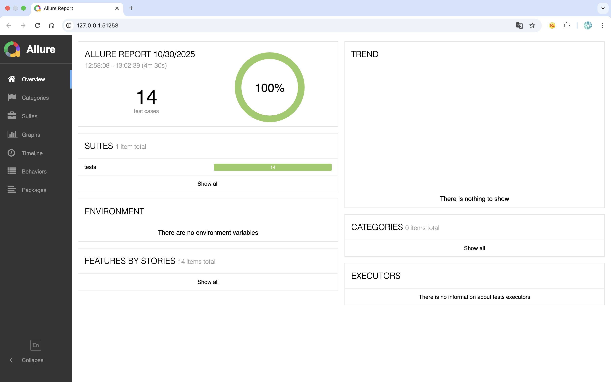
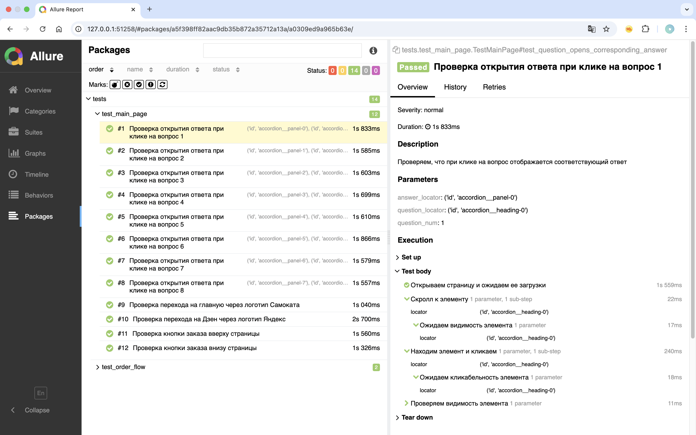
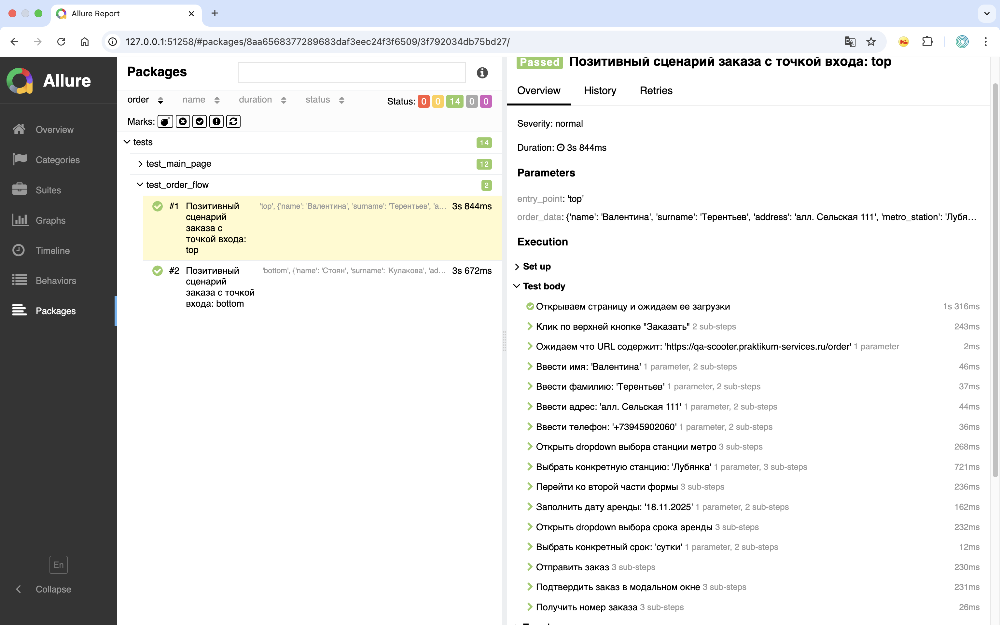
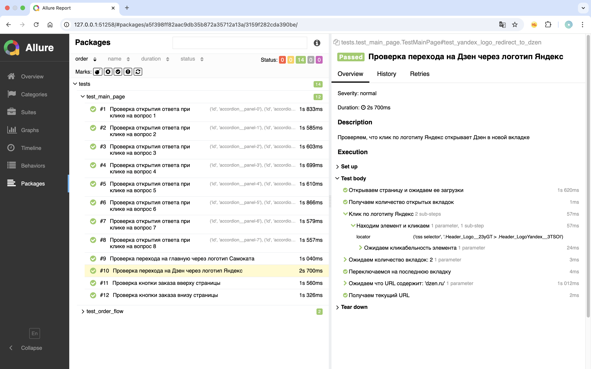

# Автотесты для Яндекс.Самокат
Проект автоматизации тестирования сервиса "Яндекс.Самокат" с использованием Page Object Model и Allure-отчетов dsgjkyty выполнен в рамках обучения.

##  О проекте

Проект содержит автотесты для проверки функциональности веб-приложения [**«Яндекс.Самокат»**](https://qa-scooter.praktikum-services.ru) - сервиса аренды самокатов:
- Тестирование выпадающего списка "Вопросы о важном"
- Позитивные сценарии оформления заказа
- Проверка навигации по логотипам
- Тестирование через разные точки входа

**Тестовый стенд:** https://qa-scooter.praktikum-services.ru


## Структура проекта (в составе портфолио)
Этот проект является частью портфолио `QA_profile`. 

**Расположение в портфолио:** 
`QA_profile/01_ui_testing/yandex_samokat_ui/`

После клонирования всего репозитория перейдите в эту папку для работы с проектом.


### Директории и файлы:
- **`allure-report/`** — содержит сгенерированный Allure-отчет (HTML-версия)
- **`images/`** — содержит скриншоты Allure-отчетов и результатов тестирования
  - `allure_overview.png` — общая статистика тестов
  - `faq_question_1_cost.png` — пример теста вопросов
  - `order_flow_top.png` — процесс заказа
  - `navigation_yandex_logo.png` — навигация по логотипам
  
- **`pages/`** — содержит классы Page Object, которые инкапсулируют взаимодействие с элементами страницы.
  - **`base_page.py`** — базовый класс для всех страниц, содержащий общие методы (открытие страницы, поиск элементов, etc.).
  - **`main_page.py`** — класс для главной страницы сервиса, содержит методы для взаимодействия с элементами главной страницы.
  - **`order_page.py`** — класс для страницы заказа, содержит методы для заполнения формы заказа и взаимодействия с ее элементами.

- **`locators/`** — содержит классы с локаторами элементов для каждой страницы.
  - **`base_page_locators.py`** — локаторы для элементов, общих для нескольких страниц (например, хедер).
  - **`main_page_locators.py`** — локаторы для элементов главной страницы (вопросы, ответы, кнопки заказа).
  - **`order_page_locators.py`** — локаторы для элементов страницы заказа (поля формы, кнопки, etc.).

- **`tests/`** — содержит тестовые сценарии, разделенные по функциональности.
  - **`test_main_page.py`** — тесты для главной страницы (вопросы-ответы, навигация, кнопки заказа).
  - **`test_order_flow.py`** — тесты для потока заказа (позитивные сценарии с разными наборами данных).

- **`data.py`** — содержит статические данные для тестов (станции метро, периоды аренды, etc.).

- **`helper.py`** — содержит функции для генерации тестовых данных (например, генерация данных заказа с помощью Faker).

- **`urls.py`** — содержит URL-адреса приложения.

- **`conftest.py`** — содержит фикстуры pytest (инициализация драйвера, настройка ожиданий).

- **`requirements.txt`** — список зависимостей проекта.

- **`README.md`** — документация проекта.

### Установка и запуск
```bash
#Клонировать портфолио и перейти в папку проекта
git clone https://github.com/Crypt0mnesia/QA_profile.git
cd QA_profile/01-ui-testing/yandex_samokat_ui

# Создать и активировать виртуальное окружение
python -m venv .venv
source .venv/bin/activate  # или .venv\Scripts\activate на Windows

# Установка зависимостей
pip install -r requirements.txt.txt

# Запуск тестов с генерацией отчетов
pytest tests/ --alluredir=allure-results
allure serve allure-results
```

### Запуск конкретных тестов
```bash
# Только тесты главной страницы
pytest tests/test_main_page.py --alluredir=allure-results

# Только тесты процесса заказа
pytest tests/test_order_flow.py --alluredir=allure-results

# Запуск с подробным выводом
pytest -v tests/ --alluredir=allure-results
```

### Тестовые сценарии
### Главная страница (test_main_page.py)
- Проверка ответов на вопросы - 8 параметризованных тестов
- Навигация по логотипам - переход на Дзен и главную
- Точки входа в заказ - верхняя и нижняя кнопки "Заказать"

### Процесс заказа (test_order_flow.py)
- Позитивный сценарий заказа - полный флоу оформления
- Разные точки входа - параметризация по кнопкам заказа
- Генерация данных - автоматическая генерация тестовых данных

Ключевые технологии
Selenium WebDriver - автоматизация браузера
Pytest - фреймворк для тестирования
Allure - создание детальных отчетов
Page Object Model - паттерн проектирования тестов
Faker - генерация реалистичных тестовых данных

###  Результаты тестирования

### Полный Allure отчет

**Детальный отчет со всеми тестами, шагами и графиками доступен в папке [allure-report/](allure-report/index.html)**

**Общий отчет Allure**


**Пример теста вопросов**


**Процесс заказа**


**Навигация по логотипам**


###  Просмотр Allure-отчёта

Для просмотра полного отчёта:

1. **Скачайте репозиторий**
2. **Перейдите в папку `allure-report`**
3. **Запустите локальный сервер:**
   ```bash
   cd allure-report
   python -m http.server 8000
   ```
4. **Откройте в браузере:** http://localhost:8000
